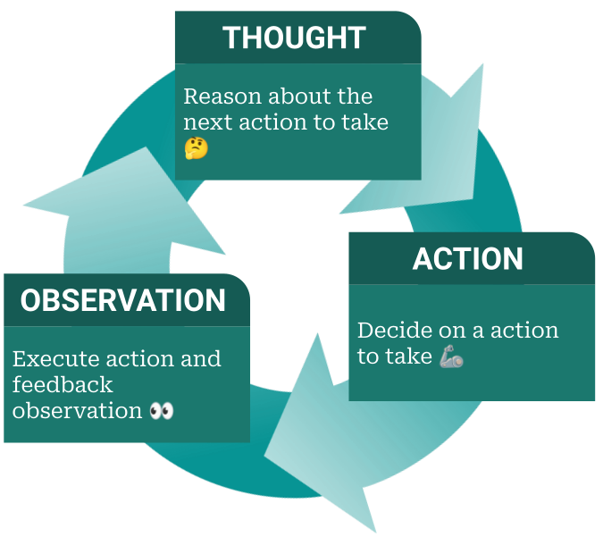

# Vanilla ReAct LLM Agent

This repository contains the implementation of the [ReAct: Synergizing Reasoning and Acting in Language Models](https://arxiv.org/abs/2210.03629), which is a model that combines reasoning and acting capabilities in language models. 

The approach is based on the idea of combining reasoning and acting capabilities in language models to enable them to perform complex tasks that require multiple steps of reasoning and acting. 
The model is designed to be modular and extensible, allowing it to be easily adapted to different tasks and domains.
[See](https://medium.com/@jainashish.079/build-llm-agent-combining-reasoning-and-action-react-framework-using-langchain-379a89a7e881)
for more details.
<!--[See](https://llm-chronicles.com/pdfs/llm-chronicles-6.4-llm-agents_chain-of-thought_react.pdf) --> 



ReAct model is behind most Agent frameworks, such as: 
- [AutoGPT](https://github.com/Significant-Gravitas/AutoGPT)
- [Anthropics Computer use](https://github.com/anthropics/anthropic-quickstarts/tree/main/computer-use-demo)
- [CrewAI](https://crewai.com/)
- [LangChain](https://python.langchain.com/v0.1/docs/modules/agents/agent_types/react/)
- [LLamaIndex](https://docs.llamaindex.ai/en/stable/examples/agent/react_agent_with_query_engine/)

## Setup
You need to first have an OpenAI API key and store it in the environment variable ``OPENAI_API_KEY`` (see [here](https://help.openai.com/en/articles/5112595-best-practices-for-api-key-safety)).
- `pip install -r requirements.txt`
- `export OPENAI_API_KEY=your_api_key`
- `PYTHONPATH=src python examples/search/main.py`

## ReAct using OpenAI functions
We can improve the ReAct model by using OpenAI functions. See the implementation in the `examples/airline/airline.py` file.
- `PYTHONPATH=src python examples/airline/airline.py`

Example of a conversation:

```
Question: Find the double of Barack Obama's age.

Thought: To find the double of Barack Obama's age, I will follow these steps:

1. **Find Barack Obama's birth date**: I will search for his birth date on Wikipedia.
2. **Calculate his age**: Once I have his birth date, I will compare it to today's date to determine his current age.
3. **Double his age**: Finally, I will multiply his age by 2 using the Calculator tool.

Now, I will start by searching for Barack Obama's birth date on Wikipedia.
Assistant: I should use this tool: WikipediaSearch. I need to find Barack Obama's birth date to calculate his current age.
Action params: {'search_query': 'Barack Obama birth date'}
Action Result: Barack Obama birthday is 04/08/1961
Observation: The context is not enough to answer the request because I need to calculate Barack Obama's current age by comparing his birth date (04/08/1961) to today's date, which I do not have.
Thought: To proceed with the task of finding the double of Barack Obama's age, I will follow these steps:

1. **Get today's date**: I will use the Date_of_today tool to find out the current date.
2. **Calculate Barack Obama's age**: Using his birth date (04/08/1961) and today's date, I will calculate his age.
3. **Double his age**: Finally, I will multiply his age by 2 using the Calculator tool.

Now, I will start by getting today's date.
Assistant: I should use this tool: Date_of_today. I need to get today's date to calculate Barack Obama's current age based on his birth date.
Action params: {}
Action Result: 2024-09-17
Observation: The context is not enough to finally answer the request because I still need to calculate Barack Obama's age using the birth date (04/08/1961) and today's date (2024-09-17). After that, I can double his age.
Thought: To find the double of Barack Obama's age, I will proceed with the following steps:

1. **Calculate Barack Obama's age**: His birth date is 04/08/1961, and today's date is 2024-09-17. I will calculate his age by finding the difference between these two dates.
2. **Double his age**: After calculating his age, I will multiply it by 2 using the Calculator tool.

Now, I will calculate Barack Obama's age. 

First, I will determine the number of years between 1961 and 2024. Then, I will check if he has had his birthday this year to finalize his age. 

Let's perform the calculation. 

1. Calculate the difference in years: 2024 - 1961. 
2. Check if his birthday has occurred this year (since today is September 17 and his birthday is April 8, it has occurred).

Now, I will use the Calculator tool to perform the first calculation. 

Calculating: 2024 - 1961. 
Assistant: I should use this tool: Calculator. I need to calculate the difference in years between 2024 and 1961 to determine Barack Obama's age.
Action params: {'operation': 'subtract', 'a': 2024, 'b': 1961}
Action Result: 63
Observation: The context is not enough to finally answer the request because I still need to double Barack Obama's age after calculating it.
Thought: To find the double of Barack Obama's age, I will proceed with the following steps:

1. **Barack Obama's age**: I have calculated that he is currently 63 years old.
2. **Double his age**: Now, I will multiply his age by 2 using the Calculator tool.

Now, I will perform the calculation to double his age.

Calculating: 63 * 2. 
Assistant: I should use this tool: Calculator. I need to multiply Barack Obama's age (63) by 2 to find the double of his age.
Action params: {'operation': 'multiply', 'a': 63, 'b': 2}
Action Result: 126
Observation: The double of Barack Obama's age is 126.
Thought: I now know the final answer. 

Final Answer: The double of Barack Obama's age is 126.
```